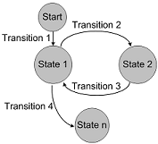

---
testspace:
title: Turn on power
---

  

# {{ spec.title }}
This tests different startup stages of the application when turning on the power. It will eventually be transitioning to an `idle` state. 

Mode 1.a | Mode 2.c
-------- | --------
 State 1 | State 1x.a
 State 7 | State 7x.b
 NA      | Current

 
 
## Check Transitions
The display will be changed based on the following configurations: 

- Check for the first transition after power-up
- Check next step for **id=17.xx**. Should display the local URL. 

## Power Scenario
The power scenario requires quick cycling, going over each scene in less than `10` seconds.

- Going online **without** system configuration set to `ABC`
- Verify system turns on and display *blinking every 3 seconds*

## Switch On
The switch-on will be very rapid based on the `Mode 2.c`. 

- Go back on line to check for turn-off switch
- Check UI mode display

## Turn off delay
The turn off delay verification is used for input configuration.

- Go back on line to check for switch-on
- Check UI mode display

## Full Idle Mode
The idle can switch automatically based on previous configuration.

- Go back on line to check for switch-off
- Check UI mode display

## [teardown]
Now review the states based on following diagram:

